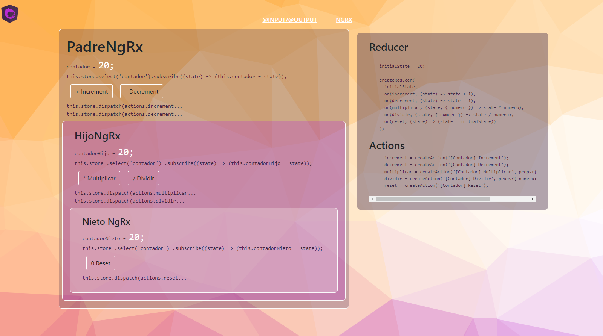

# NgRx Basics

## Implementación del patrón Redux en aplicación angular

### App Contador implementación de comunicación mediante @Input @Output vs NgRx


---

Conceptos y ejemplos sobre el manejo Action, Reducer, State, Store

## Redux

- La información se encuentra en una estructura previamente definida.
- Toda la información estará almacenada en el STORE
- El STORE no se modifica de forma directa
- Cualquier interacción con el STORE se realiza mediante el disparo (DISPATCH) de acciones ( ACTIONS )

- El estado actual de la información se llama STATE
- Un nuevo estado es creado con base a la combinación del estado anterior (OldState) y una acción (ACTION) a traves de una función pura llamada REDUCER

---

### Action

```typescript
export const increment = createAction("[Contador] Increment");
export const decrement = createAction("[Contador] Decrement");
export const multiplicar = createAction(
  "[Contador] Multiplicar",
  props<{ numero: number }>()
);
export const dividir = createAction(
  "[Contador] Dividir",
  props<{ numero: number }>()
);
export const reset = createAction("[Contador] Reset");
```

---

### Reducer

```typescript
const _counterReducer = createReducer(
  initialState,
  on(increment, (state) => state + 1),
  on(decrement, (state) => state - 1),
  on(multiplicar, (state, { numero }) => state * numero),
  on(dividir, (state, { numero }) => state / numero),
  on(reset, (state) => (state = initialState))
);

export function counterReducer(state: any, action: Action) {
  return _counterReducer(state, action);
}
```

---

### State

```typescript
const initialState = 20;
```

### Store

Responsabilidades del Store:

- Permite la lectura del estado mediante la función getState();
- Permite la creación de un nuevo estado mediante la función dispatch( action: Action )
- Permite la notificación de cambiaos mediante la subscripción.

```typescript
// app.module
StoreModule.forRoot({ contador: counterReducer }),


// custom feature...

  constructor(private store: Store<AppState>) {}

  ngOnInit(): void {
    this.store.select('contador').subscribe((state) => (this.contador = state));
  }

  incrementar() {
    this.store.dispatch(actions.increment());
  }
  decrementar() {
    this.store.dispatch(actions.decrement());
  }


```

---

### Demo


